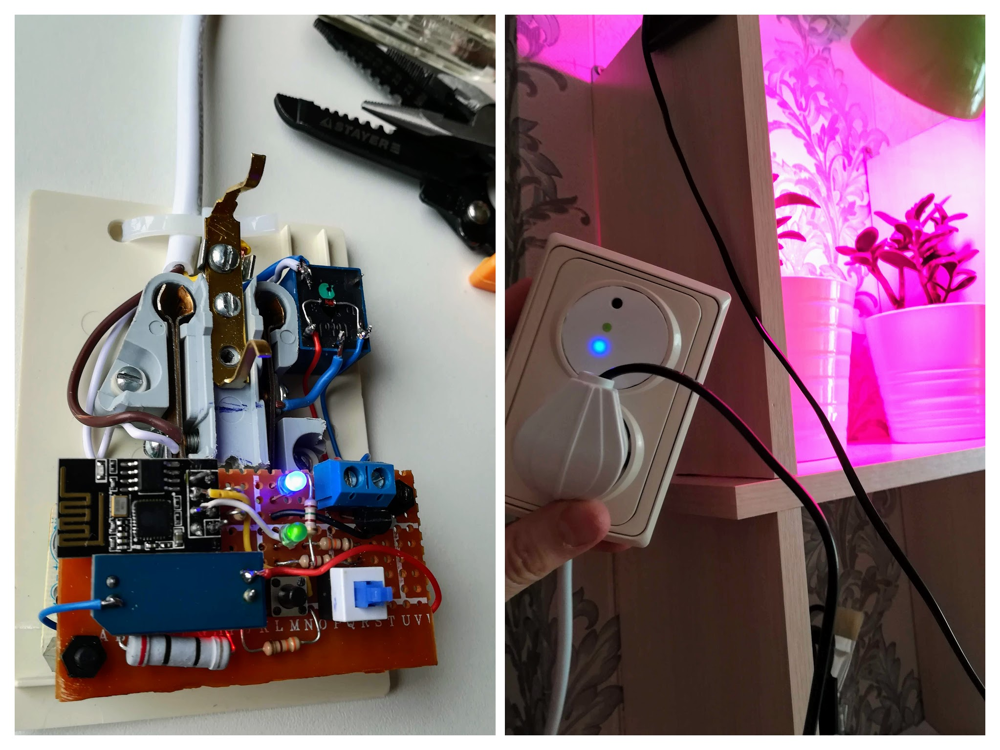

# Smart-socket-DIY
just ESP8266-enabled socket to control power in timely manner from mobile and/or MQTT service.
Main usage: switch on/off a plant growth lamp in the set hours.

Credits to Pieter P, https://tttapa.github.io/ for his amazing ESP8266 guide.

## hardware: 
+ ESP8266, both at AliExpress (so cheap that I couldn't recall the price)
+ double-outlet socket to fit electronic part
_For schematics one could check https://easyeda.com/zabelkin/esp-socket 
(it's pretty straightforward and just follows Pieter's guide)_ 

## software:
+ HW client written (or better assembled) by me, the code attached to repo
+ mobile client for Android: MQTT Dashboard (nothing fancy, but usable)
+ servers: cloudmqtt.com to publish/subscribe to IoT values, stratum2.ru for real-time requests

## Outcome:
+ Device: https://photos.app.goo.gl/pQNWRz8XmG4PF3Zt6 
+ Mobile screenshots: https://photos.app.goo.gl/pBZhv4x3zJHanh3n9 
+ Implementation :) https://photos.app.goo.gl/FTJjLZrDvb7quNfu9 

<table style="width:100%">
  <tr>
    <th>device</th>
    <th>mobile screenshot</th>
    <th>implementation</th>
  </tr>
  <tr>
    <td>
      
    <td></td>
    <td></td>
  </tr>
</table>
