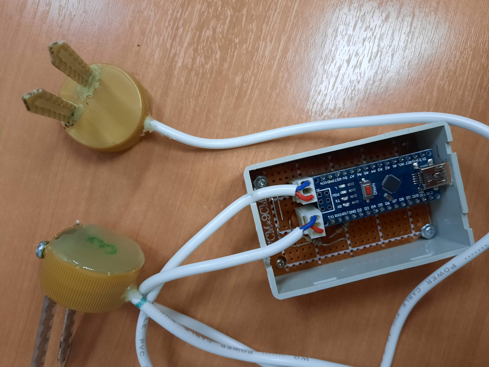
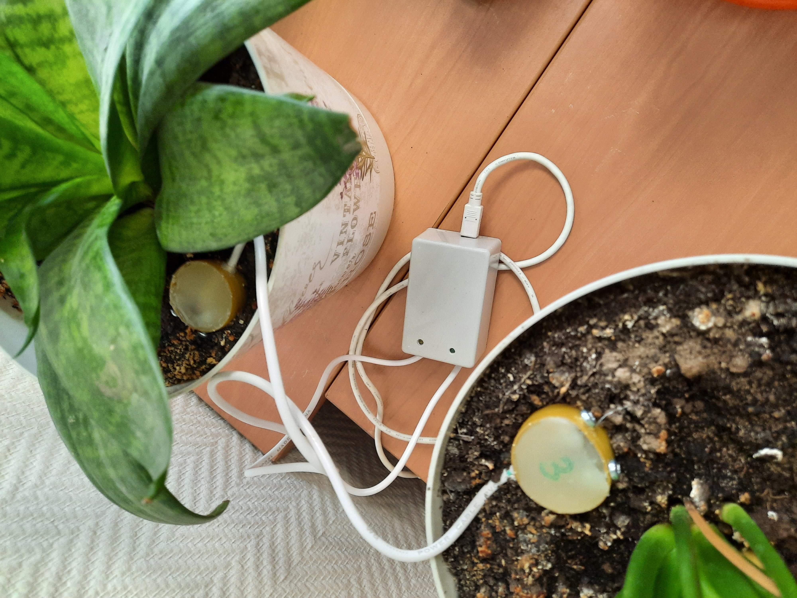

# Описание проекта

Датчик влажности почвы (не хочется руками проверять:)

+ аналоговый сигнал формируется простейшим датчиком (две пластины), подключенным к аналоговому входу Arduino Nano
+ раз в 5 секунд сигнал считывается, калибруется по шкале 1-10 (по факту 1-6) и отсылается в последовательный порт.
Формат данных <показатель по жёлтому каналу>:<показатель по зелёному каналу>. 
+ жёлтый и зелёный - два датчика, маркированы физически и в программе для удобаства
+ на компьютере раз в день по рабочим дням запускается программа sensor_serial_reading.py, считывающая показания 10 раз (для надёжности) и формирующее письмо на электронную почту с показателями.
+ как только показатели 1..6 будут привязаны к "надо полить",  письмо будет отсылаться только по необходимости

## Иллюстрации:
<table style="width:100%;table-layout:fixed">
  <tr>
    <th>устройство в сборе</th>
    <th>установка :)</th>
  </tr>
  <tr>
    <td>
      
    </td>
    <td>
      
    </td>
  </tr>
</table>
